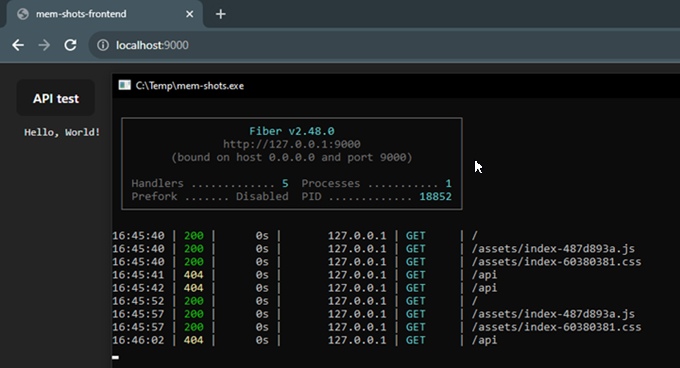

# mem-shots

Just another image gallery for cherished memories.

Mostly for learning more [golang](https://go.dev/learn/).
* simple REST api with *go*
* use with *svelte*
* embed the frontend into the binary
* use local/in-memory database
* *ffmpeg* integration
* edit/delete functions guarded with *one time password*
* fun

Sources to read:
* [How to Use go:embed in Go | The JetBrains Blog](https://blog.jetbrains.com/go/2021/06/09/how-to-use-go-embed-in-go-1-16/)
* [Create a Restful API with Golang from scratch - DEV Community](https://dev.to/pacheco/create-a-restful-api-with-golang-from-scratch-42g2)
* [otp package - github.com/pquerna/otp - Go Packages](https://pkg.go.dev/github.com/pquerna/otp#section-readme)
* [ostafen/clover: A lightweight document-oriented NoSQL database written in pure Golang.](https://github.com/ostafen/clover)
* [cosmtrek/air: ☁️ Live reload for Go apps](https://github.com/cosmtrek/air)
* [Clean and simple hot-reloading on uninterrupted go applications | by Xabier Larrakoetxea | ITNEXT](https://itnext.io/clean-and-simple-hot-reloading-on-uninterrupted-go-applications-5974230ab4c5)
* [gofiber/recipes: 📁 Examples for 🚀 Fiber](https://github.com/gofiber/recipes)

```
#DEV
fontend> pnpm run dev
> go run main.go

#DEV + live reload
> go install github.com/cosmtrek/air@latest
> air init
> air

#BUILD
fontend> pnpm run build
> go build
```

Running the built binary:
